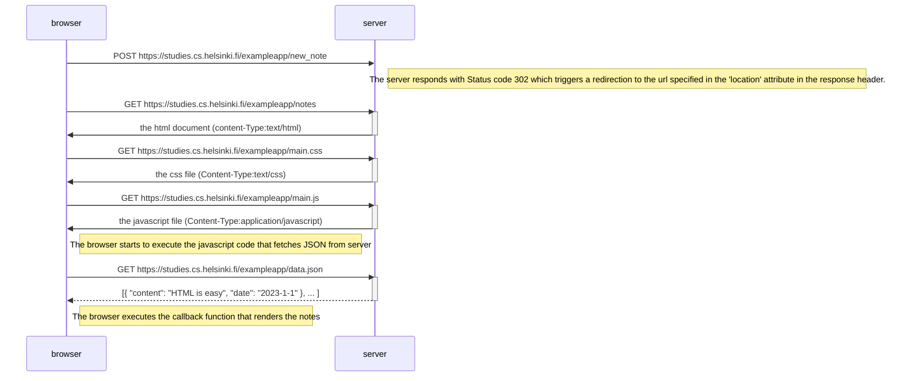

### Figure 1: Creating a new note (POST request and redirect)

```mermaid
  sequenceDiagram
  participant browser
  participant server
	
  browser->>server: POST https://studies.cs.helsinki.fi/exampleapp/new_note
  Note right of server: The server responds with Status code 302 which triggers a redirection to the url specified in the 'location' attribute in the response header.
	
  browser->>server: GET https://studies.cs.helsinki.fi/exampleapp/notes
	
  activate server
  server->>browser: the html document (content-Type:text/html)
  deactivate server
	
	browser->>server: GET https://studies.cs.helsinki.fi/exampleapp/main.css
	
	activate server
	server->>browser: the css file (Content-Type:text/css)
	deactivate server
	

	browser->>server: GET https://studies.cs.helsinki.fi/exampleapp/main.js
	
	activate server
	server->>browser: the javascript file (Content-Type:application/javascript)
	deactivate server

	Note right of browser: The  browser starts to execute the javascript code that fetches JSON from server
	
	browser->>server: GET https://studies.cs.helsinki.fi/exampleapp/data.json
	
  activate server
  server-->>browser: [{ "content": "HTML is easy", "date": "2023-1-1" }, ... ]
  deactivate server    

  Note right of browser: The browser executes the callback function that renders the notes 
```
*Author: Thasneem Chalil*
	
		
